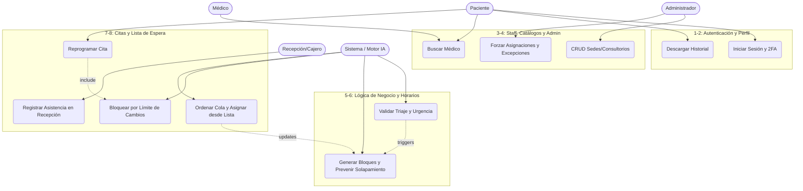
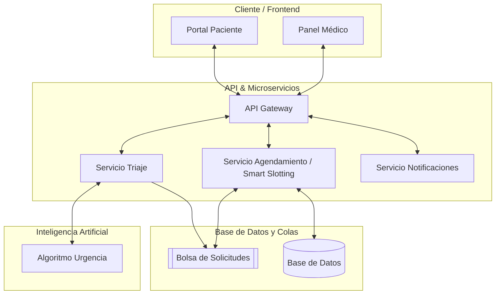
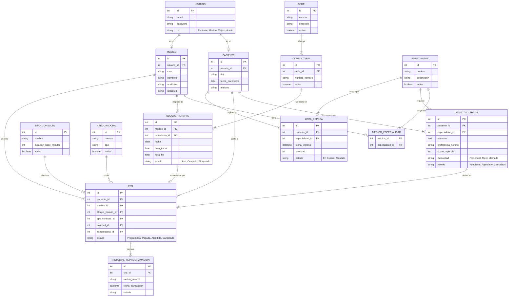
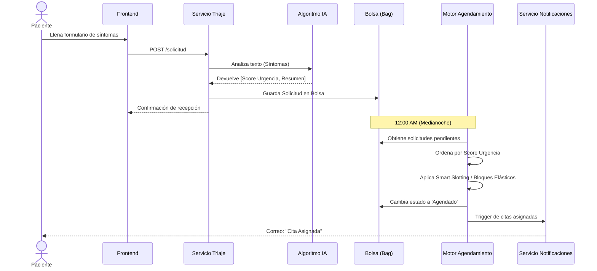
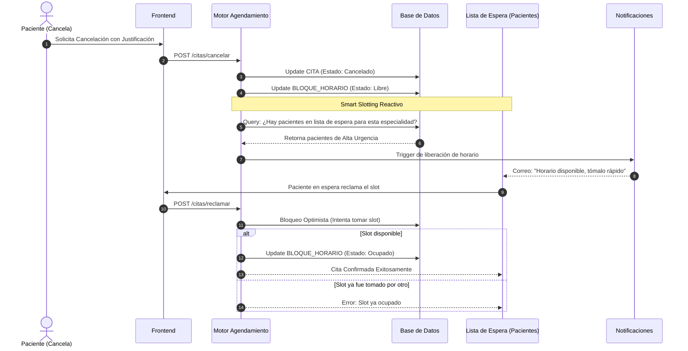

# Plan de Proyecto: SI-SALUD

**Descripción:** Plataforma web para una clínica pública enfocada en la gestión inteligente de citas médicas. Utiliza un formulario de triaje inicial, evaluación algorítmica de urgencia, y asignación de horarios en lote (batch) mediante un motor inteligente de slots.

---

## 1. Requerimientos Funcionales (RF) y No Funcionales (RNF)

A continuación, los requerimientos distribuidos por módulos principales, integrando las nuevas características de SI-SALUD.

### Módulo 1 y 2: Autenticación y Pacientes (PAC)
* **RF-01 (Registro y 2FA):** El sistema debe permitir el registro de pacientes, inicio de sesión con doble factor de autenticación (2FA) y recuperación de cuenta.
* **RF-02 (Dashboard y Perfil):** El paciente podrá gestionar su perfil, ver historial de citas y descargar documentos.

### Módulo 3 y 4: Directorio Médico y Catálogos (ADM)
* **RF-03 (Directorio y Búsqueda):** Visualización del staff médico con filtros (especialidad, nombre). El médico puede ver su agenda diaria y emitir recetas.
* **RF-04 (Gestión de Sedes y Excepciones):** El administrador debe realizar CRUD de sedes y consultorios, además de forzar consultas emergentes o aprobar excepciones.

### Módulo 5: Motor de Lógica de Negocio (TRI)
* **RF-05 (Triaje IA y Validaciones):** Detección de formularios de urgencia, validación de edad y compatibilidad de especialidad mediante algoritmos.
* **RF-06 (Bolsa de Solicitudes):** Las solicitudes validadas deben almacenarse en una "bolsa" (bag) en estado de espera para su procesamiento.

### Módulo 6: Horarios y Disponibilidad (MIA)
* **RF-07 (Time-Slotting y Prevención de Solapamiento):** Creación de slots de tiempo en bloques fijos para prevenir cruces de horarios. Modificación de disponibilidad por el admin.
* **RF-08 (Asignación Batch y Bloques Elásticos):** Proceso cron de medianoche para asignar bloques de tiempo flexibles dependiendo de la complejidad deducida.

### Módulo 7 y 8: Gestión de Citas y Lista de Espera (CIT)
* **RF-09 (Asistencia y Ticket Temporal):** El área de recepción podrá registrar la asistencia física del paciente y generar un ticket de atención.
* **RF-10 (Límites de Reprogramación):** El sistema debe permitir cancelar o reprogramar citas, aplicando un bloqueo por límite de cambios si se abusa del sistema.
* **RF-11 (Lista de Espera Reactiva):** Ordenar la cola de pacientes por prioridad y asignar turnos liberados de forma reactiva a quienes estén esperando.

### Requerimientos No Funcionales (RNF)
* **RNF-01 (Usabilidad):** Diseño completamente responsive, cumpliendo heurísticas de usabilidad.
* **RNF-02 (Seguridad):** Encriptación de datos sensibles y contraseñas. Protección de historias clínicas (cumplimiento de leyes de protección de datos).
* **RNF-03 (Concurrencia y Atomicidad):** Bloqueos optimistas/pesimistas para la reserva de slots (ACID), evitando cruce de citas.
* **RNF-04 (Trazabilidad y Log):** Registro de auditoría de todas las acciones críticas (cancelaciones, procesamiento de lotes, modificaciones).
* **RNF-05 (Rendimiento del Algoritmo):** El procesamiento en lote de la medianoche debe ser capaz de procesar miles de solicitudes de forma eficiente.

---

## 2. Diagramas Propuestos (UML)

### 2.1 Diagrama de Casos de Uso

### 2.2 Diagrama de Arquitectura / Componentes

### 2.3 Diagrama Entidad-Relación (DER)

### 2.4 Diagrama de Secuencia (Flujo de Agendamiento)

### 2.5 Diagrama de Secuencia (Flujo Reactivo: Cancelación y Lista de Espera)

---

## 3. Historias de Usuario

*(Formato: Como [tipo de usuario], quiero [acción] para [beneficio])*

### HU-01: Formulario de Triaje y Captura de Preferencias
**Como** paciente,
**Quiero** completar un formulario describiendo mis síntomas y seleccionando mis preferencias de horario/modalidad,
**Para que** el sistema evalúe mi solicitud y me asigne el mejor turno.
*   **Criterios de Aceptación:**
    *   Campos requeridos: Síntomas, Modalidad preferida (Presencial/Meet/Teléfono), Preferencia de Horario.
    *   La solicitud debe guardarse en la BD en estado "Pendiente".
    *   El sistema debe llamar a la IA para guardar el "Score de urgencia".

### HU-02: Procesamiento Batch a Medianoche
**Como** administrador del sistema,
**Quiero** que un cron job procese la bolsa de solicitudes a las 12:00 AM,
**Para que** se asigne de forma automática los horarios óptimos a los pacientes.
*   **Criterios de Aceptación:**
    *   El proceso solo procesa solicitudes en estado "Pendiente".
    *   Prioriza primero por `score_urgencia`.
    *   Busca disponibilidad aplicando *Smart Slotting*.
    *   Asigna la cita a la cuenta del paciente.

### HU-03: Check-in de Confirmación (2 días antes)
**Como** clínica,
**Quiero** enviar un recordatorio al paciente 48 horas antes de su cita para que confirme asistencia,
**Para que** reduzcamos el ausentismo (No-Shows).
*   **Criterios de Aceptación:**
    *   Envío automático de SMS/Correo con enlace seguro.
    *   Si cancela, el slot se libera.

### HU-04: Cancelación Justificada y Lista de Espera
**Como** paciente,
**Quiero** poder cancelar mi cita justificando el motivo,
**Para que** el horario quede libre y notifique a otros pacientes urgentes.
*   **Criterios de Aceptación:**
    *   Modal obligatorio para escribir justificación de mínimo 10 caracteres.
    *   Al confirmar cancelación, buscar en la bolsa a pacientes compatibles y notificarles (Lista de espera inteligente).

### HU-05: Panel del Médico e Historia Clínica
**Como** médico,
**Quiero** visualizar mi agenda del día, el resumen de triaje de cada paciente y poder redactar indicaciones,
**Para que** pueda llevar el control de mis consultas y prescribir recetas.
*   **Criterios de Aceptación:**
    *   La vista debe cargar las citas agendadas filtradas por `medico_id` y fecha.
    *   Debe existir un formulario para ingresar diagnóstico (CIE-10) y observaciones médicas.
    *   Opción para generar una receta/indicación descargable en PDF.

### HU-06: Facturación y Validación de Pagos
**Como** cajero,
**Quiero** visualizar las órdenes de pago pendientes y confirmar recepciones de transferencia/efectivo,
**Para que** la cita pase a estado "Pagada" de forma oficial.
*   **Criterios de Aceptación:**
    *   Si el paciente seleccionó "Transferencia", el cajero debe poder ver el voucher adjunto (foto).
    *   Botón para "Aprobar Pago" que cambie el estado de la cita y genere un comprobante (Boleta/Factura).
    *   Trazabilidad (log) de qué usuario aprobó el pago.

### HU-07: Directorio Médico Público
**Como** usuario público,
**Quiero** buscar y visualizar el staff médico filtrando por especialidad,
**Para que** pueda conocer el perfil de los doctores antes de iniciar el triaje.
*   **Criterios de Aceptación:**
    *   Página de acceso público (sin login).
    *   Barra de búsqueda en tiempo real (respuesta en < 3s).
    *   Vista de perfil con foto, CMP (colegiatura) y especialidades.

### HU-08: Gestión de Sedes, Aseguradoras y Bloques de Horario
**Como** administrador,
**Quiero** gestionar el catálogo de sedes físicas, consultorios, aseguradoras y los bloques de horarios fijos,
**Para que** el algoritmo pueda asignar los turnos y espacios físicos sin conflictos.
*   **Criterios de Aceptación:**
    *   CRUD completo para Sedes, Consultorios, Aseguradoras y Tipos de Consulta.
    *   Generador de bloques de horario fijos (slots) por médico y consultorio.
    *   Relación de médicos con múltiples especialidades (N:M).

### HU-09: Recepción y Registro de Asistencia
**Como** personal de recepción,
**Quiero** registrar la llegada física del paciente a la sede,
**Para que** el sistema genere un ticket temporal de atención y notifique al médico que el paciente lo espera.
*   **Criterios de Aceptación:**
    *   Buscador rápido de pacientes por DNI o código de cita.
    *   Botón de "Registrar Asistencia" que actualiza el estado de la cita a "En Espera en Consultorio".
    *   Generación (mock) de Ticket de turno impreso/digital.

### HU-10: Reglas de Reprogramación y Bloqueos
**Como** sistema,
**Quiero** limitar la cantidad de veces que un paciente reprograma o cancela citas tardíamente,
**Para que** pueda bloquear temporalmente la reserva de citas si se detecta abuso.
*   **Criterios de Aceptación:**
    *   Lógica para contar repeticiones de cancelaciones en el `Historial_Reprogramacion`.
    *   Bloqueo automático de agendamiento si supera el límite definido (ej. 3 veces).
    *   Opción para que el Administrador apruebe excepciones y levante el castigo.

---

## 4. Estimación y Desglose en Tareas Técnicas

### Requerimiento: HU-01 (Formulario de Triaje y Captura)
*   **Estimación:** 8 Puntos de Historia / ~24 Horas
*   **Tareas:**
    1.  [Frontend] Diseñar y maquetar formulario (React/Next.js) con validaciones.
    2.  [Backend] Crear endpoint `POST /api/triaje/solicitud`.
    3.  [Backend] Integrar SDK de IA para procesar el campo `síntomas` y obtener score de urgencia.
    4.  [BD] Crear migración para tabla `SolicitudTriaje`.

### Requerimiento: HU-02 (Procesamiento Batch Medianoche)
*   **Estimación:** 13 Puntos de Historia / ~40 Horas
*   **Tareas:**
    1.  [Infra] Configurar servicio Cron para ejecutar tarea a las 00:00.
    2.  [Backend] Crear script de obtención y ordenamiento de `SolicitudTriaje`.
    3.  [Backend] Desarrollar algoritmo *Smart Slotting* para buscar huecos libres en la agenda.
    4.  [Backend] Lógica de *Bloques Elásticos* (ajustar duración de la cita según la IA).
    5.  [BD] Configurar transacciones ACID para evitar concurrencia.
    6.  [Backend] Enviar correos de "Cita Confirmada".

### Requerimiento: HU-04 (Cancelación y Lista de Espera)
*   **Estimación:** 5 Puntos de Historia / ~16 Horas
*   **Tareas:**
    1.  [Frontend] Modal de cancelación con formulario de justificación.
    2.  [Backend] Endpoint `POST /api/citas/cancelar`.
    3.  [Backend] Event Listener: Al cancelar, buscar pacientes compatibles en espera.
    4.  [Backend] Integración con servicio de correo para alertas.

### Requerimiento: HU-05 (Panel Médico y Recetas PDF)
*   **Estimación:** 8 Puntos de Historia / ~24 Horas
*   **Tareas:**
    1.  [Frontend] Dashboard médico con agenda diaria y resumen IA.
    2.  [Backend] Endpoints para historia clínica `GET /api/historia/:id` y `POST /api/historia/guardar`.
    3.  [Backend] Generación dinámica de PDF (ej. con Puppeteer o PDFKit) para recetas.
    4.  [BD] Creación de tablas para `HistoriaClinica` y `Recetas`.

### Requerimiento: HU-06 (Módulo de Caja y Pagos)
*   **Estimación:** 8 Puntos de Historia / ~24 Horas
*   **Tareas:**
    1.  [Frontend] Panel administrativo para visualización de "Órdenes Pendientes" y "Vouchers".
    2.  [Backend] Lógica de estado de cita: "Agendada" -> "Pagada".
    3.  [Backend] Integración de subida de imágenes (vouchers) a Cloud Storage (ej. AWS S3 o Firebase Storage).
    4.  [BD] Crear tabla de logs (trazabilidad) para auditar quién aprueba los pagos.

### Requerimiento: HU-08 (Mantenimiento de Catálogos: Sedes, Seguros y Bloques Fijos)
*   **Estimación:** 10 Puntos de Historia / ~30 Horas
*   **Tareas:**
    1.  [Frontend] Paneles CRUD para gestionar `Sedes`, `Consultorios`, `Aseguradoras` y `Tipos de Consulta`.
    2.  [Backend] Endpoints de mantenimiento (crear, leer, actualizar, desactivar).
    3.  [BD] Motor para generar `Bloques_Horarios` fijos semanalmente asociados a un `Medico` y un `Consultorio`.
    4.  [Backend] Integrar la validación de seguros y consultorios en el motor de agendamiento Batch de medianoche.

### Requerimiento: HU-09 y HU-10 (Asistencia en Sede y Bloqueos)
*   **Estimación:** 8 Puntos de Historia / ~24 Horas
*   **Tareas:**
    1.  [Frontend] Módulo de Recepción (Dashboard para buscar citas del día y generar tickets).
    2.  [Backend] Endpoint de Check-in físico `POST /api/recepcion/asistencia`.
    3.  [Backend] Middleware/Servicio para auditar límite de reprogramaciones/cancelaciones por paciente cruzando con `Historial_Reprogramacion`.
    4.  [Frontend] Vista Admin para "Levantar Castigos / Aprobar Excepciones".

---

## 5. Lógica Core: El Motor Inteligente de Agendamiento (Slotting)

El sistema basa su capacidad de orquestación en tres pilares lógicos interconectados, garantizando la optimización de los espacios médicos sin solapamientos:

### 5.1 Time-Slotting Estricto (Bloques Fijos)
En lugar de calcular tiempos libres sobre la marcha, la tabla `BLOQUE_HORARIO` se pre-puebla de manera estática con celdas de tiempo fijas (ej. 15 minutos).
*   **Por qué:** Asegura una transaccionalidad ACID perfecta. Asignar un turno consiste simplemente en cambiar el estado de un bloque físico de `"Libre"` a `"Ocupado"`, evitando por completo el solapamiento de horarios bajo concurrencia extrema.

### 5.2 Bloques Elásticos (Triaje Dinámico)
La IA del triaje evalúa no solo la urgencia de la solicitud, sino también su **complejidad**.
*   **Cómo:** Si una solicitud es rutinaria, se le asigna 1 bloque (15 min). Si la IA deduce síntomas complejos o primera visita, exige 2 o 3 bloques de reserva. El sistema "estira" la cita para ajustarse al paciente real sin retrasar al médico.

### 5.3 Smart Slotting & Lista de Espera (Bolsa Batch)
*   **A medianoche:** El cron job lee la "Bolsa" (solicitudes en `Pendiente`), las ordena por prioridad, e intenta hacer "Tetris" buscando bloques `"Libres"` **consecutivos** que calcen con los Bloques Elásticos requeridos.
*   **Lista de Espera Inmediata:** Si un paciente cancela durante el día, sus bloques pasan de `"Ocupado"` a `"Libre"`. El *Smart Slotting* se dispara reactivamente buscando en la tabla `LISTA_ESPERA` quién necesita exactamente esos bloques y les notifica instantáneamente.

---

## 6. Arquitectura y Stack Tecnológico Propuesto

Para satisfacer los requerimientos de SEO (Directorio Médico), procesamiento concurrente asíncrono (Bolsa de Medianoche) y usabilidad en tiempo real, se propone el siguiente stack técnico moderno:

*   **Frontend (UI/UX):**
    *   **Framework:** Next.js (App Router) + React. Ideal por su Server-Side Rendering (SSR) que ayuda al SEO del directorio público, y la rapidez para el panel administrativo.
    *   **Estilos:** TailwindCSS (para diseño rápido y responsive) + Shadcn UI (para componentes accesibles y modernos: modales, tablas, calendarios interactivos).
*   **Backend (API & Lógica):**
    *   **Framework:** Next.js Route Handlers (API robusta dentro del mismo entorno).
    *   **ORM / Base de Datos:** Prisma ORM interactuando con **PostgreSQL**. PostgreSQL es excelente para mantener la integridad relacional (ACID) exigida en los requerimientos financieros y médicos.
*   **Inteligencia Artificial:**
    *   **Modelo:** API de LLM Libre / Abierta (Open Source / Agnostic) para el análisis de lenguaje natural en el triaje de síntomas y deducción de urgencias.
*   **Procesamiento Asíncrono (Batch & Colas):**
    *   **Colas y Caché:** Redis (para mantener la Bolsa de Solicitudes) + **BullMQ** (para orquestar el Cron Job de asignación a medianoche y envío de notificaciones encoladas sin bloquear el servidor principal).
*   **Autenticación y Seguridad:**
    *   **Sistema:** NextAuth.js (Auth.js) para el manejo de sesiones con JWT y validación estricta de Roles (RBAC). Cifrado de contraseñas nativo (Bcrypt).
